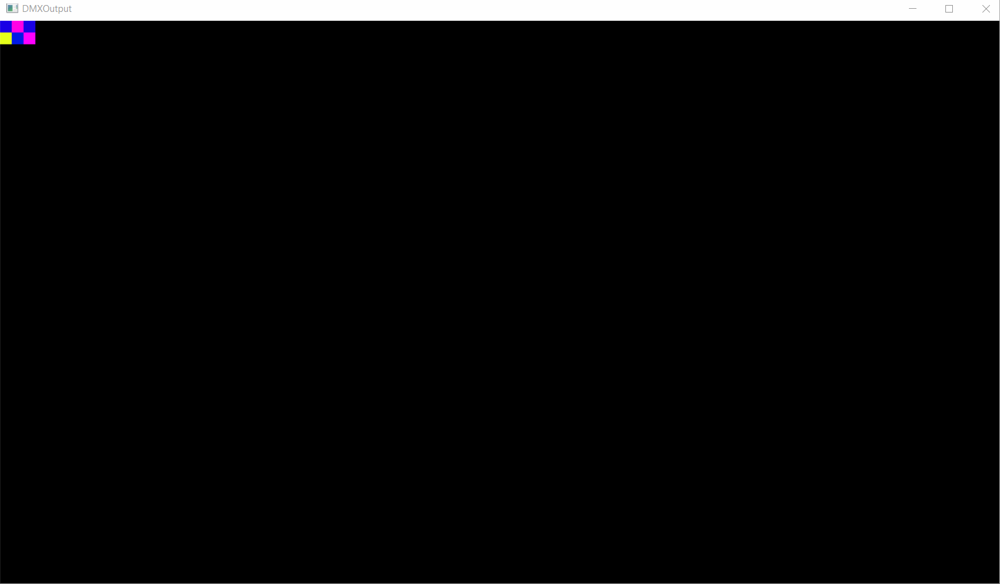

# DMX2Screen

Simple Python program that takes DMX data over Art-Net and displays it as coloured squares.

*Like this!*

## What do I need?
Was build on Python 3.12, but it probably works on other versions. Other than the built-in libraries (and the included  library), it needs the [Art-Net decoder](https://github.com/sciencegey/python_artnet) [OpenCV2](https://pypi.org/project/opencv-python/) (and Numpy along with it), and [NDI-python](https://github.com/buresu/ndi-python) for NDI output.

## How do I use it?
Simply define your "lighting fixtures" in the fixtures.json file (filename and path can be set in the config file). The included file gives you an example of how to setup both **"sectors"** (fixed-size blocks that make it quick and easy to position them) and **"blocks"** (blocks that can be any size).

The config.ini file is used to configure the program. And example is included that has all the options available. If the setting isn't set, or the file isn't present, it will just use the built-in defaults :)

You can also use the parameters -C or --config to specify a config location.

## OK, so what do I use it for?
Great question! I don't really know, if you figure that out let me know ;)

# License
This project is licensed under an MIT License (see the [LICENSE](https://github.com/sciencegey/DMX2Screen/blob/main/LICENSE) file).